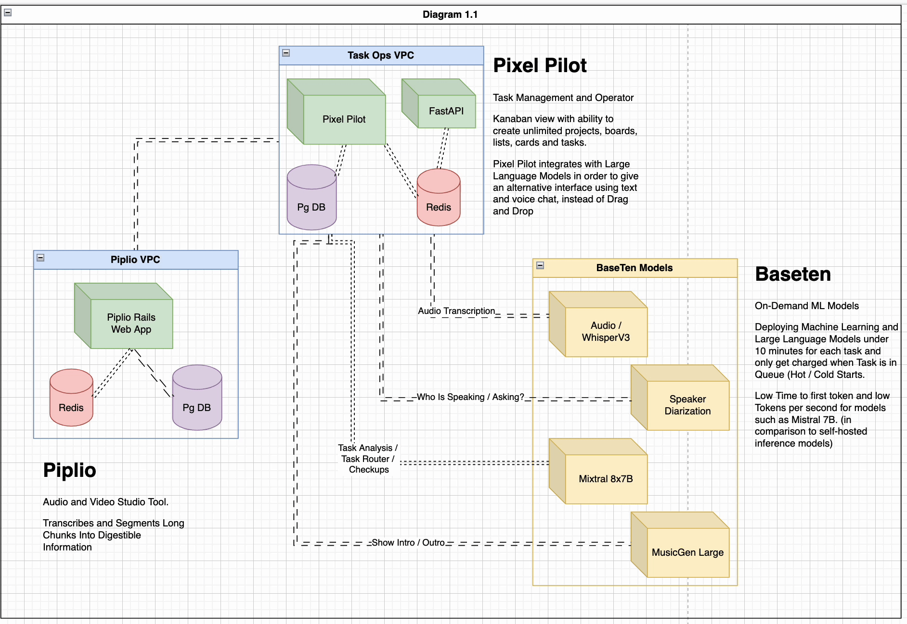
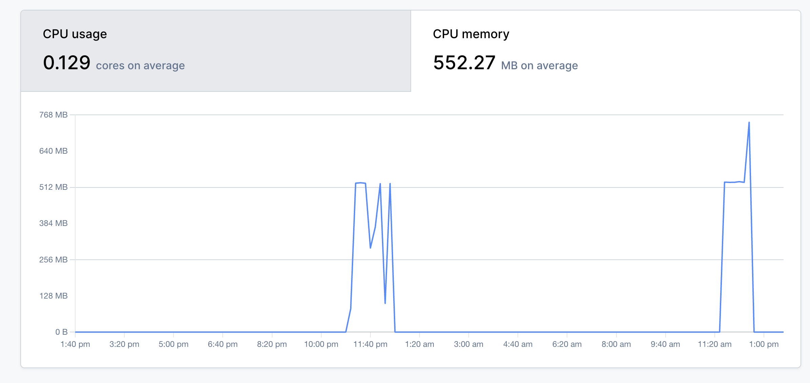
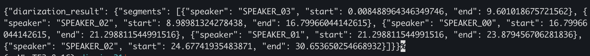

## Welcome To My Baseten Projects

This repo contain some examples for Machine Learning models and Large Language Models used for my personal projects that are deployed on Baseten.

Currently, I have two models that are deployed on Baseten:
1. Custom WhisperV3 Model.
2. Custom Speaker Diarization Model.


Below, you will find a step-by-step guide on how to use the Baseten Truss library to deploy a HuggingFace Pipeline on Baseten through the CLI.


This is a diagram of how I utilize / Integrate the ML and LLM models in my projects.





## Step by Step to Deploy a Model that uses Hugging Face Pipeline with Baseten

What is Baseten, and Why Should You Use It?

Baseten offers a platform that simplifies all the steps needed to deploy a model into production and more. This includes a CLI tool called Truss, which creates a standardized model skeleton. This skeleton includes all the necessary files and directories needed to deploy a model on Baseten. The Truss CLI also allows you to deploy the model with a single command, and it handles all the necessary steps to deploy the model into production.


If you have ever tried to deploy a machine learning model to production manually on your own AWS/GCP servers, as you read this you might be having flashbacks of horror.
Given the nightmarish complexity of the task, here's a concise list of considerations for deploying a model into production:

  - Monitoring Model Performance
    - Scaling Model Resources (CPU, Memory, GPU)
    - Model Logs and Metrics
  - Managing Model Dependencies
    - Model System Packages (ffmpeg, etc.)
    - Model Python Libraries (torch, transformers, etc.)
  - Managing Model Deployment
    - Model Testing (Unit Tests, Integration Tests)
    - Model Rollbacks (Versioning)
    - Model Updates (Hotfixes, New Features)
    - Model Versions (A/B Testing / DEV, STAGING, PROD)
  - Managing Model Security:
    - Model Secrets (API Keys, Tokens)
    - Model Configurations (Environment Variables)
    - Model Permissions (Who can access the model)
    - Model Access (API Keys, Tokens)
  - CI/CD Pipelines
    - Model Training
    - Model Testing
    - Model Deployment
    - Model Monitoring
  - Dockerizing the Model
    - Model Dockerfile
    - Model Docker Image Versioning
    - Model Docker Container Management


### Part 1: Model Skeleton

1. I use Pyenv locally to manage my python versions. I have a python 3.8.5 version installed.
2. I have a virtual environment created with python 3.8.5.
3. Install the Baseten CLI.
   - ```pip install --upgrade truss```
4. Create a new project with the Baseten CLI.
   - ```truss init diarize31```

We will do the integration of the HuggingFace pipeline in the next steps, then after that, we will deploy the model on Baseten, and finally, we will test the model.

5. Since we are including a secret token in the config.yml for the model, we will use:
- ```truss push --trusted```
6. After deploying the model, we initially use a curl command to test it:

```bash
curl -X POST https://model-FINDINTERMINAL_OR_DASHBOARD.api.baseten.co/development/predict \
  -H 'Authorization: Api-Key GENERATE_IN_WEB_UI' \
  -d '{"url": "DIRECT_LINKTO_SMALL_AUIDO_FILE.mp3"}
```

7. output:

```json
{"diarization_result": {"segments": [{"speaker": "SPEAKER_03", "start": 0.008488964346349746, "end": 9.601018675721562}, {"speaker": "SPEAKER_02", "start": 8.98981324278438, "end": 16.79966044142615}, {"speaker": "SPEAKER_00", "start": 16.79966044142615, "end": 21.298811544991516}, {"speaker": "SPEAKER_01", "start": 21.298811544991516, "end": 23.879456706281836}, {"speaker": "SPEAKER_02", "start": 24.67741935483871, "end": 30.653650254668932}]}}%
```


----

### Part 2: Model Exploration

This is the model that I would like to deploy on Baseten, it is a Speaker Diarization model that uses the HuggingFace pipeline (pyannote library).

- [Link](https://huggingface.co/pyannote/speaker-diarization-3.1)

- In another example, that will be posted later, we have transcribed the audio file to text, and then we will use the speaker diarization model to identify the speakers in the audio file.
- speaker diarization is a the task of determining "who spoke when" in an audio file.


- It requires the end-user to sign a few agreements before using the model. Once that's done, we can test the model offline within a script, then integrate it with Baseten.

```python
import os
from pyannote.core import Annotation

HUGGINGFACE_ACCESS_TOKEN = os.environ["HUGGINGFACE_ACCESS_TOKEN"]

# Instantiate the pipeline
from pyannote.audio import Pipeline
pipeline = Pipeline.from_pretrained(
    "pyannote/speaker-diarization-3.1",
    use_auth_token=HUGGINGFACE_ACCESS_TOKEN
)

audio_file_path = "LINK_TO_AUDIO_FILE.mp3"


# Run the pipeline on an audio file
diarization = pipeline(audio_file_path, min_speakers=2, max_speakers=5)

# Adjust the diarization object URI for RTTM output
safe_uri = os.path.basename(audio_file_path).replace(" ", "_")
if hasattr(diarization, 'uri'):
    diarization.uri = safe_uri
else:
    # yeah lets make sure it doesn't fail silently
    print("Adapt this step based on the actual structure of the diarization object.")

# Dump the diarization output to disk using RTTM format
with open("audio.rttm", "w") as rttm:
    diarization.write_rttm(rttm)
```

the output of the script will be an RTTM file that contains the speaker diarization results, like this:

```bash
SPEAKER New_Podcast_Coming_Soon_Blowback.mp3 1 0.008 9.576 <NA> <NA> SPEAKER_04 <NA> <NA>
SPEAKER New_Podcast_Coming_Soon_Blowback.mp3 1 8.990 7.827 <NA> <NA> SPEAKER_03 <NA> <NA>
SPEAKER New_Podcast_Coming_Soon_Blowback.mp3 1 16.817 4.516 <NA> <NA> SPEAKER_00 <NA> <NA>
SPEAKER New_Podcast_Coming_Soon_Blowback.mp3 1 21.333 2.666 <NA> <NA> SPEAKER_01 <NA> <NA>
SPEAKER New_Podcast_Coming_Soon_Blowback.mp3 1 24.694 5.976 <NA> <NA> SPEAKER_02 <NA> <NA>

```


---

### Part 3: Model Integration

Before we do the integration, I did some exploration for existing examples on truss-examples repo, and I found a similar example that uses the HuggingFace pipeline and also uses the Baseten tempfile library, which somewhat functions similar to Google Colab's tempfile library, or any other temporary file library for Linux.

- [Solid Resources Truss Examples](https://github.com/basetenlabs/truss-examples)

1. Since we already have a skeleton model from the first step, we will now integrate the HuggingFace pipeline with the Baseten model.
   1. First, import the necessary libraries as follows:
   ```python
    import os
    import tempfile
    from typing import Dict

    import requests
    from pyannote.audio import Pipeline
    ```

    2. ``__init__`` method:
   ```python
        self._data_dir = kwargs["data_dir"]
        self._secrets = kwargs["secrets"]
        self.pipeline = None
    ```

    3. ```load``` method:
   ```python
        # Load the HuggingFace speaker diarization pipeline
        HUGGINGFACE_ACCESS_TOKEN = self._secrets["hf_access_token"]
        self.pipeline = Pipeline.from_pretrained(
            "pyannote/speaker-diarization-3.1",
            use_auth_token=HUGGINGFACE_ACCESS_TOKEN
        )
    ```

    4. ```preprocess``` method:

   ```python
        audio_url = request["url"]

        # Stream the download for large files
        with requests.get(audio_url, stream=True) as r:
            r.raise_for_status()  # Ensure the download succeeded
            temp_audio_file = tempfile.NamedTemporaryFile(delete=False, suffix=".mp3")
            for chunk in r.iter_content(chunk_size=8192):
                temp_audio_file.write(chunk)
            temp_audio_file.close()

        return {"audio_file_path": temp_audio_file.name}
    ```

    5. ```predict``` method:
   ```python
        audio_file_path = request["audio_file_path"]

        # Run the diarization pipeline
        diarization_result = self.pipeline(audio_file_path, min_speakers=2, max_speakers=5)

        # Serialize the diarization result to a format that can be converted to JSON
        # Assuming diarization_result is an instance of pyannote.core.Annotation
        result_data = {
            "segments": [
                {
                    "speaker": label,
                    "start": segment.start,
                    "end": segment.end,
                }
                for segment, _, label in diarization_result.itertracks(yield_label=True)
            ]
        }

        # Clean up the temporary file
        os.remove(audio_file_path)

        return {"diarization_result": result_data}
    ```
2. Now, we have `model.py`, next order of business is to update the `config.yml` file to include the HuggingFace access token and package requirements.

```yaml
name: diarize31  # Updated to match the project name
environment_variables: {}
model_name: diarization-model  # Customized to your model's purpose
python_version: py39  # Updated to Python 3.9 as per your new snippet
requirements:
  - torch==2.0.1
  - transformers==4.30.2  # Ensure compatibility with your model dependencies
  - pyannote.audio  # Essential for your diarization model
  - huggingface_hub  # For HuggingFace model access
  - ffmpeg-python==0.2.0  # For audio processing
  # Add any other libraries your model specifically requires
resources:
  cpu: "1"
  memory: 2Gi
  use_gpu: false  # Set to true if your model significantly benefits from GPU acceleration
  accelerator: null  # Specify an accelerator if using GPU
secrets:
  hf_access_token: hf_TOKEN_HERE_FROM_HUGGINGFACE_API  # Ensure this is correctly set in Baseten's secrets manager
system_packages:
  - ffmpeg  # ffmpeg is commonly needed for audio file processing

```

3. and now, finally we go back to Part 1 and deploy the model on Baseten and test the output.


---

Part 4: Debugging and Testing the Model.

- At first, I kept getting a system error, and I realized that I forgot to include the `ffmpeg` system package in the `config.yml` file.
- Then I encountered an error with the `tempfile` library, and I realized that filename needs to be sanitized before using it in the RTTM file.
- Then, I started encountering timeout errors. It was unclear what was causing these issues, as there were no explicit errors. The model simply took too long to process the audio file. To resolve this, I increased the server size from 2GB to 8GB.


- Then it all worked out, and I got the expected output from the model.

